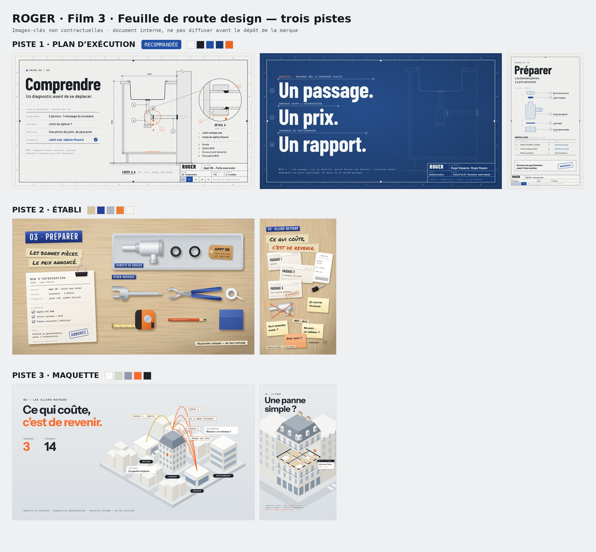

# ROGER — feuille de route design (film 3)

Ce dossier propose trois pistes pour changer complètement le design des films ROGER, en restant dans l'univers
professionnel du bâtiment. Chaque piste est montrée en images-clés (style frames), en 16:9 et en 9:16. La
feuille de route se termine par un comparatif, une recommandation, les étapes jusqu'au film et les décisions à prendre.

> **Document de travail interne.** Les pistes sont des propositions à valider par les associés. Les images-clés
> ne sont pas contractuelles, et la fuite sous l'évier est le scénario de démonstration de la Genèse v2. Rien ne
> doit être diffusé avant le dépôt de la marque.

**À ouvrir :** `feuille-de-route-design.html`, une page autonome avec images et polices intégrées. Un clic sur une
image l'agrandit. Pour un aperçu rapide, voir `planche-pistes.jpg`.



## Les pistes

| Piste | Idée | Images |
|---|---|---|
| **1 · Plan d'exécution** (recommandée) | Le film comme un dossier technique qui se dessine : coupe, détail agrandi, nomenclature, tirage bleu. | `p1-comprendre`, `p1-promesse`, `p1-preparer-9x16` |
| **2 · Établi** | Vue de dessus d'un plan de travail : le vrac des allers-retours, puis les bonnes pièces rangées au cordeau. | `p2-preparer`, `p2-allers-9x16` |
| **3 · Maquette** | L'immeuble et le quartier en maquette d'architecte : étages soulevés, trajets en arcs empilés. | `p3-allers`, `p3-panne-9x16` |

Les trois pistes gardent l'histoire et les garde-fous de la Genèse : aucun personnage « Roger », « un passage »
présenté comme un objectif, aucun écran d'application montré comme réel, dépannage et remise en état séparés.

## Fichiers

- `frames/plan.html`, `frames/etabli.html`, `frames/maquette.html` : les images-clés, dessinées en SVG. Chaque
  page lit `?f=<image>`, et `frames/kit.js` contient les outils communs.
- `frames/fonts.py` : télécharge les polices depuis Google Fonts (licences OFL et Apache) dans `frames/fonts/`.
- `render-frames.mjs` : rend les images dans Chromium et les écrit dans `images/`.
- `page.html` et `build.py` : la page de la feuille de route, et son assemblage en un fichier autonome.

## Refaire les images et la page

```bash
npm install
python3 frames/fonts.py     # polices → frames/fonts/
node render-frames.mjs      # images-clés → images/ (ou : node render-frames.mjs p1-comprendre)
python3 build.py            # → feuille-de-route-design.html
```
