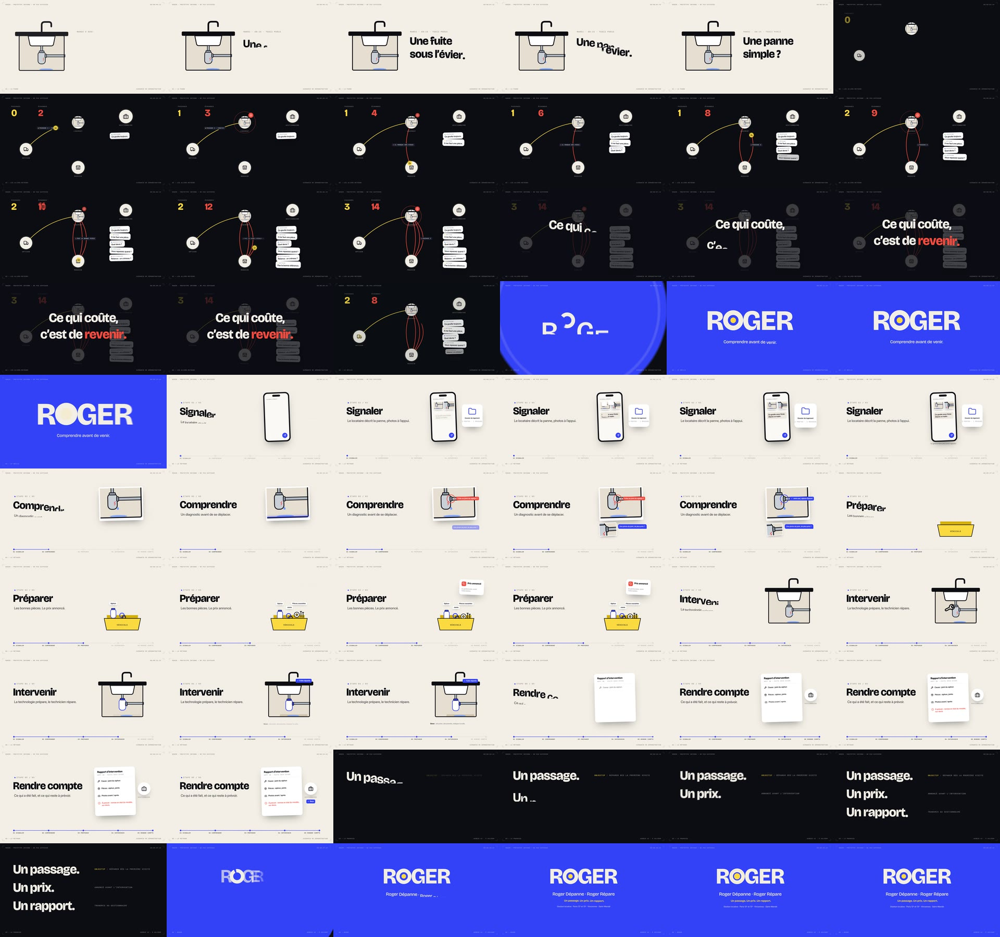

# ROGER — « Un passage. Un prix. Un rapport. » (30 s)

Deuxième film de motion design sur ROGER, construit d'après le document interne
« ROGER — Genèse : Roger Dépanne, Roger Répare » (v2 du 24 septembre 2026). L'image et le son sont
**entièrement générés par code**. Le film existe en deux formats, avec la même animation et la même bande-son :
**16:9** (1920 × 1080) et **9:16** (1080 × 1920). Il tourne à 60 images/s, avec flou de bouger et son stéréo 48 kHz.

> **Prototype interne, à ne pas diffuser.** La Genèse doit encore être validée par les quatre associés.
> Elle prévoit qu'aucun support ne soit publié ou diffusé avant le dépôt de la marque. Ce film sert donc à la
> discussion interne et n'est pas prêt à être posté. Les rappels « Prototype interne — ne pas diffuser »,
> « Scénario de démonstration » et « Genèse v2 · à valider » sont incrustés à l'image. L'identité visuelle
> (couleurs, typographies, logotype « R⊙GER ») reste une proposition.



## Déroulé (96 BPM, 12 mesures = 30,000 s)

L'histoire suit la tension proposée par la Genèse : une panne survient, puis les allers-retours et les relances
s'accumulent. ROGER comprend avant de venir, l'intervention est préparée, et le gestionnaire connaît la suite
et reçoit un compte rendu.

| Temps | Séquence | Ce qu'on voit |
|---|---|---|
| 0 – 2,5 s | 01 · La panne | Mardi, 8 h 15, Paris 12ᵉ : une fuite sous l'évier. « Une panne simple ? » |
| 2,5 – 10 s | 02 · Les allers-retours | L'évier se réduit à un point sur un plan. Le technicien fait trois passages au logement, entrecoupés d'allers au magasin (il manque une pièce, puis ce n'est pas la bonne). Les messages du locataire, de l'artisan, du propriétaire et du gestionnaire s'empilent et les compteurs montent. Le constat tombe : « Ce qui coûte, c'est de revenir. » |
| 10 – 12,5 s | 03 · Le déclic | Tout se rembobine et laisse un seul trajet, direct. Apparaissent le logotype R⊙GER et « Comprendre avant de venir. » |
| 12,5 – 25 s | 04 · La méthode | Les cinq étapes sur le fil rouge de la fuite : **Signaler** (photos), **Comprendre** (diagnostic avant le déplacement, précision demandée), **Préparer** (siphon, joints, pièces courantes, prix annoncé), **Intervenir** (réparation, ou « sécuriser, documenter, indiquer la suite »), **Rendre compte** (rapport au gestionnaire) |
| 25 – 27,5 s | 05 · La promesse | « Un passage. » (présenté comme **objectif**), « Un prix. » (annoncé avant l'intervention), « Un rapport. » (transmis au gestionnaire) |
| 27,5 – 30 s | 06 · Roger | Logotype, « Roger Dépanne · Roger Répare », gestion locative, Paris 12ᵉ et 13ᵉ, Vincennes, Saint-Mandé |

## Comment le film applique la Genèse

- **Pas de personnage « Roger ».** Roger est un nom d'équipe et de service, pas une mascotte ni un faux technicien. Il n'apparaît que comme logotype.
- **« Un passage » est présenté comme un objectif, pas comme une garantie.** Le film écrit « Objectif : réparer dès la première visite ». L'étape Intervenir montre aussi le cas contraire : « Sinon : sécuriser, documenter, indiquer la suite. »
- **Un prix :** il est « annoncé avant l'intervention » et adressé au gestionnaire. Le film n'affiche ni montant ni condition, puisque celles-ci restent à verrouiller.
- **Un rapport :** il est « transmis au gestionnaire » et dit ce qui a été fait et ce qui reste à prévoir. Le film suit ainsi la phrase de la Genèse : le locataire signale, puis le gestionnaire reçoit le prix, puis le rapport.
- **Le dépannage et la remise en état restent distincts.** Le rapport liste « À prévoir : remise en état du meuble, sur devis » comme un besoin séparé. La fuite est réparée, mais le meuble abîmé n'est pas compris dans le dépannage.
- **La cible est le gestionnaire.** Le propriétaire n'apparaît que dans les échanges de la situation actuelle (« Quel devis ? »). Le film ne lui fait aucune vente directe.
- **Le scénario est une démonstration.** La fuite sous l'évier est le fil rouge de la Genèse. Elle est signalée à l'image comme « Scénario de démonstration » et n'est pas présentée comme un vrai chantier.
- **Aucun écran d'application.** Le téléphone, le diagnostic, la préparation et le rapport sont des illustrations schématiques. Le film ne montre ni « tour du logement », ni préconisation chiffrée automatiquement, ni messages automatiques, ni créneaux proposés.
- **Le film ne promet rien de ce qui est exclu.** Il ne parle pas d'abonnement, d'intervention le soir, la nuit ou le week-end (la scène se passe un mardi à 8 h 15), ni d'IA vendue au client, d'assurance ou de délai garanti. Il ne mentionne pas non plus le mois de test, dont les modalités ne sont pas encore validées.
- **La zone de démarrage est respectée :** Paris 12ᵉ et 13ᵉ, Vincennes, Saint-Mandé.

## Points à faire valider

- **Les phrases à l'écran.** « Ce qui coûte, c'est de revenir. » reprend la Genèse. Deux phrases la condensent : « Comprendre avant de venir. » et « La technologie prépare, le technicien répare. » (la Genèse dit : « La technologie sert à préparer le travail ; c'est le technicien qui répare »).
- **Les chiffres de la séquence 02** (3 passages, 14 échanges) illustrent le scénario. Ce ne sont pas des mesures.
- **L'étape Comprendre** montre un examen des photos (balayage, puis diagnostic). Le film ne dit pas si c'est une personne ou un outil. On peut l'ajuster si l'on veut écarter toute lecture « IA ».
- **L'identité visuelle et le logotype** sont proposés, pas validés.

## Fichiers

- `cues.js` : la partition commune (tempo, instants clés), lue à la fois par l'image et par le son.
- `index.html`, `style.css`, `main.js` : l'animation, soit GSAP en pause et des effets procéduraux. Les mises en page 16:9 et 9:16 sont décrites en tête de `main.js` (`LAND` et `VERT`), et `window.seek(t)` rend l'image exacte à l'instant `t`.
- `audio.mjs` : la bande-son synthétisée, écrite dans `out/audio.wav`. Elle contient la musique, la goutte, la sonnette à chaque passage, le moteur de la camionnette, le rembobinage, le déclencheur photo, la clé à cliquet et le « Roger beep » final.
- `render.mjs` : le rendu image par image dans Chromium, la moyenne des sous-images (flou de bouger) et l'encodage H.264 + AAC.
- `roger_genese.mp4` (16:9) et `roger_genese_9x16.mp4` (9:16) : les deux films.
- `storyboard.jpg` et `storyboard_9x16.jpg` : une image toutes les 0,5 s.

La version 9:16 n'est pas un recadrage : chaque scène est recomposée (éléments empilés, textes plus grands, textes
importants tenus hors des zones couvertes par l'interface des réseaux sociaux).

## Refaire le rendu

Prérequis : Node 18+, `ffmpeg` avec `libx264` dans le `PATH`.

```bash
npm install
npx playwright install chromium   # si Chromium n'est pas déjà installé
npm run fonts          # Bricolage Grotesque, Inter, JetBrains Mono (Google Fonts, licence OFL)
npm run render         # → out/roger_genese.mp4 (environ 6 min sur 4 cœurs)
npm run render:9x16    # → out/roger_genese_9x16.mp4
```

Autres commandes :

```bash
node render.mjs stills 4.4 16.3 26.2                  # images fixes → out/stills/
node render.mjs stills --format 9x16 4.4 16.3 26.2    # → out/stills_9x16/
npm run audio && npm run preview       # puis ouvrir http://localhost:8080/index.html?play (clic pour lancer)
                                       # ou index.html?play&format=9x16 pour le vertical
```

Pour changer un texte, une couleur ou un timing, il faut modifier `main.js` (textes et couleurs en tête de fichier) et
`cues.js` (instants). L'image et le son restent synchronisés tant qu'on modifie les instants dans `cues.js`.
