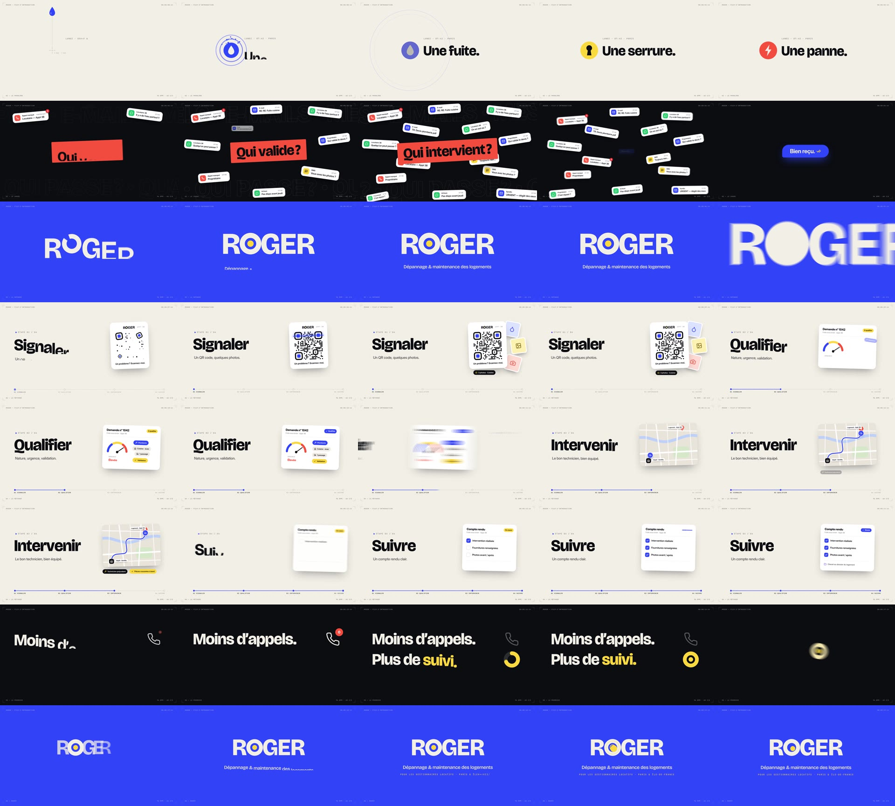

# ROGER — film d'introduction (20 s)

Film de motion design de 20 secondes présentant ROGER, avec image et son **entièrement générés par code**.
Deux formats, même animation et même bande-son : **16:9** (1920 × 1080) et **9:16** (1080 × 1920, pour Reels, TikTok, Shorts et stories).
60 images/s, flou de bouger (obturateur à 180°), son stéréo 48 kHz.



> L'identité visuelle (couleurs, typographies, logotype « R⊙GER ») et les phrases à l'écran sont des
> **propositions** : la charte de ROGER n'est pas encore validée. Les écrans d'interface sont illustratifs,
> ce ne sont pas des captures de l'application réelle.

## Déroulé (96 BPM, 8 mesures = 20,000 s)

| Temps | Séquence | Ce qu'on voit |
|---|---|---|
| 0 – 2,5 s | 01 · Le problème | Une goutte tombe sur sa cible ; « Une fuite. / Une serrure. / Une panne. » (morphing de l'icône) |
| 2,5 – 5 s | 02 · Le chaos | Avalanche de notifications (appels, e-mails, messages), « Qui valide ? / Qui intervient ? », tout est aspiré dans une seule réponse : « Bien reçu. » |
| 5 – 7,5 s | 03 · La réponse | Explosion bleue, logotype R⊙GER, signature ; plongée dans le « O » |
| 7,5 – 15 s | 04 · La méthode | Travelling sur 4 étapes : Signaler · Qualifier · Intervenir · Suivre |
| 15 – 17,5 s | 05 · La promesse | « Moins d'appels. Plus de suivi. » : le compteur redescend à 0, l'anneau se remplit |
| 17,5 – 20 s | 06 · Roger | L'anneau devient le « O » du logo final ; double bip du point (clin d'œil au « Roger beep » des radios) |

## Fichiers

- `cues.js` : la partition commune (tempo, instants clés), lue à la fois par l'image et par le son.
- `index.html`, `style.css`, `main.js` : l'animation (GSAP en pause + effets procéduraux). `window.seek(t)` rend l'image exacte à l'instant `t`.
- `audio.mjs` : la bande-son synthétisée (batterie, basse, nappes, bruitages d'interface, réverbe, limiteur) → `out/audio.wav`.
- `render.mjs` : rendu image par image dans Chromium, moyenne des sous-images (flou de bouger), encodage H.264 + AAC.
- `roger_intro.mp4` : le film en 16:9. `roger_intro_9x16.mp4` : le film en 9:16.
- `storyboard.jpg`, `storyboard_9x16.jpg` : une image toutes les 0,5 s.

La version 9:16 n'est pas un recadrage : chaque scène est recomposée (éléments empilés, textes plus grands pour le
téléphone, textes importants tenus hors des zones couvertes par l'interface des réseaux sociaux). Les deux mises en page
sont décrites en tête de `main.js` (`LAND` et `VERT`).

## Refaire le rendu

Prérequis : Node 18+, `ffmpeg` avec `libx264` dans le `PATH`.

```bash
npm install
npx playwright install chromium   # si Chromium n'est pas déjà installé
npm run fonts          # Bricolage Grotesque, Inter, JetBrains Mono (Google Fonts, licence OFL)
npm run render         # → out/roger_intro.mp4 (4 à 7 min sur 4 cœurs)
npm run render:9x16    # → out/roger_intro_9x16.mp4
```

Autres commandes :

```bash
node render.mjs stills 2.5 7.4 13.6                  # images fixes → out/stills/
node render.mjs stills --format 9x16 2.5 7.4 13.6    # → out/stills_9x16/
npm run audio && npm run preview       # puis ouvrir http://localhost:8080/index.html?play (clic pour lancer)
                                       # ou index.html?play&format=9x16 pour le vertical
```

Pour changer un texte, une couleur ou un timing : `main.js` (textes, couleurs en tête de fichier) et `cues.js` (instants).
Le rythme général se règle avec `BPM` et `DUR` dans `cues.js` : les animations gardent leur durée, seuls les temps de lecture changent
(une première version à 128 BPM durait 15 s).
L'image et le son restent synchronisés tant qu'on modifie les instants dans `cues.js`.
