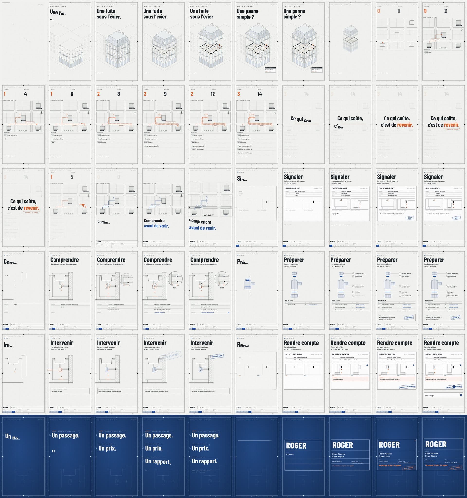

# ROGER — « Plan d'exécution » (film 3, 30 s)

Troisième film sur ROGER. Il suit la piste 1 de la feuille de route design (`../feuille-de-route-design/`) :
le film est un dossier technique qui se dessine. L'image et le son sont **entièrement générés par code**.
Le film est livré en **9:16** (1080 × 1920), à 60 images/s, avec flou de bouger et son stéréo 48 kHz.
La mise en page **16:9** (1920 × 1080) est prête dans le code, avec la même animation et la même bande-son :
`npm run render` la produit, mais elle n'a pas été rendue ici.

> **Prototype interne, à ne pas diffuser.** Le film s'appuie sur la Genèse v2, qui doit encore être validée par
> les quatre associés et qui prévoit qu'aucun support ne soit diffusé avant le dépôt de la marque. La fuite sous
> l'évier est le scénario de démonstration de la Genèse. Les plans, coupes et fiches sont des documents « de
> principe » : ce ne sont ni de vrais relevés ni des écrans d'application. L'identité visuelle reste une proposition.



## Choix faits pour ce film

- **Direction.** C'est la piste 1, « Plan d'exécution ». Elle emprunte à la piste 3 une ouverture en axonométrie, dessinée au trait.
- **Nom.** « ROGER » est écrit simplement dans la typographie de la piste, à la place du logotype R⊙GER des films 1 et 2, qui n'est pas validé.
- **Histoire.** C'est la même que celle du film 2 : la fuite sous l'évier, fil rouge de la Genèse.
- **Durée.** 30 s à 96 BPM, comme le film 2.

## Déroulé

| Temps | Séquence | Ce qu'on voit |
|---|---|---|
| 0 – 4 s | 01 · La panne | Le cadre de la planche se trace, puis l'immeuble d'angle se dessine en axonométrie. Les étages se soulèvent, l'étage 3 est coupé et la fuite est repérée dans l'appartement 3B. On lit « Une fuite sous l'évier. », puis « Une panne simple ? » |
| 4 – 10,5 s | 02 · Les allers-retours | Sur le plan de situation, on voit trois passages au logement et deux allers au magasin. Les observations s'accumulent et les compteurs montent. Puis « Ce qui coûte, c'est de revenir. » apparaît, avec une cote qui mesure « revenir. » : 3 passages, 14 échanges. |
| 10,5 – 12,5 s | 03 · Le déclic | La gomme efface les trajets et il ne reste qu'un trait bleu, « Objectif · un passage ». Le cartouche du dossier s'ouvre et on lit « Comprendre avant de venir. ». La caméra plonge alors dans le détail du logement. |
| 12,5 – 25 s | 04 · La méthode | Cinq planches se suivent. **Signaler** : une fiche de signalement, tamponnée REÇU. **Comprendre** : la coupe, un nuage de révision, le détail A et le diagnostic. **Préparer** : une vue éclatée, la nomenclature et le prix tamponné BORDEREAU. **Intervenir** : dépose, repose et serrage, tamponné FUITE RÉPARÉE. **Rendre compte** : le rapport, avec ce qui reste à prévoir, tamponné TRANSMIS AU GESTIONNAIRE. |
| 25 – 27,5 s | 05 · La promesse | La feuille devient un tirage bleu : « Un passage. Un prix. Un rapport. ». Chaque phrase est mesurée par une cote, avec une note sur l'objectif. |
| 27,5 – 30 s | 06 · Roger | Un grand cartouche s'affiche : ROGER, Roger Dépanne · Roger Répare, gestion locative, zone de démarrage, tampon « IND. A · À VALIDER » et double bip. |

## Comment le film applique la Genèse

- **Pas de personnage.** Roger n'apparaît que comme un nom, dans le cartouche.
- **« Un passage » est un objectif.** La cote l'annonce comme tel, et une note précise que certaines pannes demandent une pièce spécifique, un devis ou un second passage. La phase Intervenir montre aussi le cas contraire : « Sécuriser, documenter, indiquer la suite. »
- **Le prix est annoncé au gestionnaire, avant l'intervention.** Le film n'affiche ni montant ni condition.
- **Le rapport est transmis au gestionnaire.** Il liste « À prévoir : remise en état du meuble, sur devis », séparément de la réparation.
- **Pas d'écran d'application.** Les fiches, plans et rapports sont des documents de principe.
- **Rien de ce qui est exclu.** Le film ne parle pas d'abonnement, d'intervention le soir, la nuit ou le week-end, d'IA, d'assurance ou de délai. La scène se passe un mardi à 8 h 15.
- **La zone de démarrage est respectée :** Paris 12ᵉ et 13ᵉ, Vincennes, Saint-Mandé.

## Fichiers

- `cues.js` : la partition commune (tempo, instants clés), lue à la fois par l'image et par le son.
- `index.html`, `style.css`, `main.js` : l'animation en SVG, avec GSAP en pause et DrawSVG pour les tracés. Les mises en page 16:9 et 9:16 sont décrites en tête de `main.js` (`LAND` et `VERT`), et `window.seek(t)` rend l'image exacte à l'instant `t`.
- `audio.mjs` : la bande-son synthétisée, écrite dans `out/audio.wav`. Elle contient la musique en ré mineur puis fa majeur, le crayon, la règle, les tampons, la gomme, les feuilles de calque, la sonnette à chaque passage et le « Roger beep ».
- `render.mjs` : le rendu image par image dans Chromium, la moyenne des sous-images (flou de bouger) et l'encodage H.264 + AAC.
- `roger_plan_9x16.mp4` : le film en 9:16.
- `storyboard_9x16.jpg` : une image toutes les 0,5 s.

## Refaire le rendu

Prérequis : Node 18+, Python 3, `ffmpeg` avec `libx264` dans le `PATH`.

```bash
npm install
npx playwright install chromium   # si Chromium n'est pas déjà installé
npm run fonts          # Barlow Condensed, Barlow, IBM Plex Mono (Google Fonts, licence OFL)
npm run render:9x16    # → out/roger_plan_9x16.mp4
npm run render         # → out/roger_plan.mp4 (version 16:9)
```

Autres commandes :

```bash
node render.mjs stills 3.3 8.7 17.05                  # images fixes → out/stills/
node render.mjs stills --format 9x16 3.3 8.7 17.05    # → out/stills_9x16/
npm run audio && npm run preview       # puis ouvrir http://localhost:8080/index.html?play (clic pour lancer)
```

Pour changer un texte ou un timing, il faut modifier `main.js` (textes, couleurs et mises en page en tête de fichier) et
`cues.js` (instants). L'image et le son restent synchronisés tant qu'on modifie les instants dans `cues.js`.
